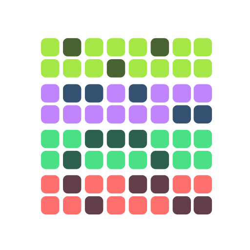
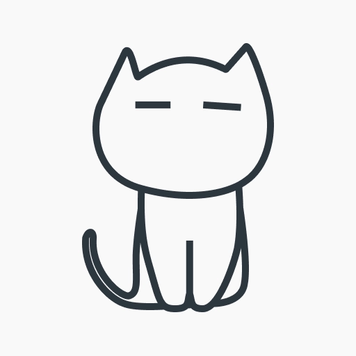

# Real-World Flutter Apps

> A curated, community-driven collection of real-world applications built with Flutter and shipped to production.

The goal of this project is to document the growing Flutter ecosystem through publicly available production applications.

---

## Statistics

| Metric | Value |
|---|---:|
| Applications | **7 Apps** |
| Categories | **3** |

---

## Applications

<table width="100%">
<thead>
<tr>
  <th width="10%" align="center">Logo</th>
  <th width="16%" align="center">App</th>
  <th width="18%" align="center">Creator</th>
  <th width="14%" align="center">Category</th>
  <th width="21%" align="center">Google Play</th>
  <th width="35%" align="center">App Store</th>
</tr>
</thead>
<tbody>

<tr style="text-align: center; vertical-align: middle;">
  <td align="center" valign="middle">
    
  </td>

  <td align="center" valign="middle">
    <strong>ELSA Speak</strong>
    <br><a href="https://elsaspeak.com/en"><small>Website</small></a>
  </td>

  <td align="center" valign="middle">
    ElSA Speak
  </td>

  <td align="center" valign="middle">
    <code>Education</code>
  </td>

  <td align="center" valign="middle">
    <a href="https://play.google.com/store/apps/details?id=us.nobarriers.elsa"><b>Link</b></a><br>
<small>
📥 10M+<br>
⭐ 4.5 (996K)<br>
📦 86 MB
</small>

  </td>

  <td align="center" valign="middle">
    <a href="https://apps.apple.com/us/app/elsa-speak-english-learning/id1083804886"><b>Link</b></a><br>
<small>
⭐ 4.8 (112K)<br>
📦 288 MB
</small>

  </td>
</tr>

<tr style="text-align: center; vertical-align: middle;">
  <td align="center" valign="middle">
    
  </td>

  <td align="center" valign="middle">
    <strong>Gemini Notebook</strong>
    <br><a href="https://notebook.google.com/?pli=1"><small>Website</small></a>
  </td>

  <td align="center" valign="middle">
    Google LLC
  </td>

  <td align="center" valign="middle">
    <code>Productivity</code>
  </td>

  <td align="center" valign="middle">
    <a href="https://play.google.com/store/apps/details?id=com.google.android.apps.labs.language.tailwind"><b>Link</b></a><br>
<small>
📥 10M+<br>
⭐ 4.8 (263K)<br>
📦 29 MB
</small>

  </td>

  <td align="center" valign="middle">
    <a href="https://apps.apple.com/us/app/gemini-notebook/id6737527615"><b>Link</b></a><br>
<small>
⭐ 4.9 (55K)<br>
📦 201 MB
</small>

  </td>
</tr>

<tr style="text-align: center; vertical-align: middle;">
  <td align="center" valign="middle">
    
  </td>

  <td align="center" valign="middle">
    <strong>HabitKit</strong>
    <br><a href="https://www.habitkit.app/"><small>Website</small></a>
  </td>

  <td align="center" valign="middle">
    Sebastian Röhl
  </td>

  <td align="center" valign="middle">
    <code>Productivity</code>
  </td>

  <td align="center" valign="middle">
    <a href="https://play.google.com/store/apps/details?id=com.roehl.habitkit"><b>Link</b></a><br>
<small>
📥 500K+<br>
⭐ 4.6 (11K)<br>
📦 30 MB
</small>

  </td>

  <td align="center" valign="middle">
    <a href="https://apps.apple.com/us/app/habit-tracker-habitkit/id6443918070"><b>Link</b></a><br>
<small>
⭐ 4.9 (2.3K)<br>
📦 216 MB
</small>

  </td>
</tr>

<tr style="text-align: center; vertical-align: middle;">
  <td align="center" valign="middle">
    
  </td>

  <td align="center" valign="middle">
    <strong>Jump Jump Vpn</strong>
    <br><a href="https://jumpjump.io/#/home/index"><small>Website</small></a>
  </td>

  <td align="center" valign="middle">
    SOON BODYWERKZ
  </td>

  <td align="center" valign="middle">
    <code>Network</code>
  </td>

  <td align="center" valign="middle">
    <a href="https://play.google.com/store/apps/details?id=app.jumpjumpvpn.jumpjumpvpn"><b>Link</b></a><br>
<small>
📥 100M+<br>
⭐ 4.5 (976K)<br>
📦 58 MB
</small>

  </td>

  <td align="center" valign="middle">
    <a href="https://apps.apple.com/us/app/jumpjumpvpn-fast-secure/id6451097052"><b>Link</b></a><br>
<small>
⭐ 4.7 (32K)<br>
📦 257 MB
</small>

  </td>
</tr>

<tr style="text-align: center; vertical-align: middle;">
  <td align="center" valign="middle">
    
  </td>

  <td align="center" valign="middle">
    <strong>StoryPad</strong>
    <br><a href="https://github.com/theachoem/storypad"><small>Website</small></a>
  </td>

  <td align="center" valign="middle">
    Thea Choem
  </td>

  <td align="center" valign="middle">
    <code>Productivity</code>
  </td>

  <td align="center" valign="middle">
    <a href="https://play.google.com/store/apps/details?id=com.tc.writestory"><b>Link</b></a><br>
<small>
📥 100K+<br>
⭐ 4.6 (797)<br>
📦 18 MB
</small>

  </td>

  <td align="center" valign="middle">
    <a href="https://apps.apple.com/us/app/vocat-my-own-vocabulary/id15385467060"><b>Link</b></a><br>
<small>
⭐ 4.9 (14)<br>
📦 115 MB
</small>

  </td>
</tr>

<tr style="text-align: center; vertical-align: middle;">
  <td align="center" valign="middle">
    
  </td>

  <td align="center" valign="middle">
    <strong>Vocat</strong>
    <br><a href="https://vocat.devstory.co.kr/en"><small>Website</small></a>
  </td>

  <td align="center" valign="middle">
    DevStory
  </td>

  <td align="center" valign="middle">
    <code>Education</code>
  </td>

  <td align="center" valign="middle">
    <a href="https://play.google.com/store/apps/details?id=kr.co.devstory.vocat&hl=en"><b>Link</b></a><br>
<small>
📥 500K+<br>
⭐ 4.5 (7.57k)<br>
📦 50 MB
</small>

  </td>

  <td align="center" valign="middle">
    <a href="https://apps.apple.com/us/app/vocat-my-own-vocabulary/id15385467060"><b>Link</b></a><br>
<small>
⭐ 4.8 (112)<br>
📦 175 MB
</small>

  </td>
</tr>

<tr style="text-align: center; vertical-align: middle;">
  <td align="center" valign="middle">
    
  </td>

  <td align="center" valign="middle">
    <strong>YPT - Yeolpumta</strong>
    <br><a href="https://www.yeolpumta.com/en/"><small>Website</small></a>
  </td>

  <td align="center" valign="middle">
    Pallo Inc
  </td>

  <td align="center" valign="middle">
    <code>Education</code>
  </td>

  <td align="center" valign="middle">
    <a href="https://play.google.com/store/apps/details?id=com.pallo.passiontimerscoped"><b>Link</b></a><br>
<small>
📥 5M+<br>
⭐ 4.6 (76K)<br>
📦 133 MB
</small>

  </td>

  <td align="center" valign="middle">
    <a href="https://apps.apple.com/us/app/ypt-study-group/id1441909643"><b>Link</b></a><br>
<small>
⭐ 4.7 (1.6K)<br>
📦 279 MB
</small>

  </td>
</tr>

</tbody>
</table>


---

## Categories

- **Education** — 3 apps
- **Network** — 1 app
- **Productivity** — 3 apps

---

## Project Structure

```text
real-world-flutter-apps/
│
├── apps/
│   └── <app-name>.yaml
│
├── assets/
│   └── <app-name>_logo.png
│
├── data/
│   └── apps.json
│
├── scripts/
│   └── generate_readme.dart
│
├── .github/
│   └── workflows/
│       └── generate-readme.yml
│
├── README.md
├── CONTRIBUTING.md
├── LICENSE
└── pubspec.yaml
````


---

## Data Model

Each application is represented by a YAML file inside the `apps/` directory.

**Example:**

```yaml
name: HabitKit
creator: Sebastian Röhl
category: Productivity

platforms:
  - android
  - ios

stores:
  google_play:
    url: "https://play.google.com/..."
    downloads: "500K+"
    rating: "4.6"
    reviews: "11K"
    size: "30 MB"

  app_store:
    url: "https://apps.apple.com/..."
    rating: "4.9"
    reviews: "2.3K"
    size: "216 MB"

official_website: "https://www.habitkit.app/"

last_verified: 2026-08-19
```


---

## Automation

The README is generated automatically from the structured application data.

When application data changes and is pushed to the main branch:

```text
Application YAML
       ↓
GitHub Actions
       ↓
Dart Generator
       ↓
README.md
       ↓
Automatic Commit
```

This keeps the README synchronized with the underlying dataset without requiring manual table updates.


---

## Contributing

Contributions are welcome. You can contribute by:

* Adding a real-world Flutter application
* Updating existing application information
* Correcting outdated statistics
* Improving the generator
* Improving documentation

Before submitting a contribution, make sure the information is based on publicly available sources and that store statistics include an appropriate verification date.

See `CONTRIBUTING.md` for contribution guidelines.


---

## Data Guidelines

The project aims to keep application data:

* Structured
* Reproducible
* Easy to update
* Machine-readable
* Human-readable

Statistics such as downloads, ratings, reviews, and application size are snapshots and may change over time.


---

## Disclaimer

This repository is a community-maintained collection of publicly available information.

Application statistics may change over time and should not be considered permanent values.

Listing an application does not imply endorsement by its developer, company, Google, Apple, or the Flutter team.


---

## License

This project is licensed under the MIT License.
